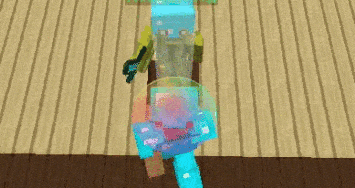
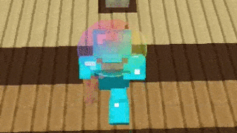
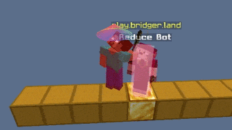
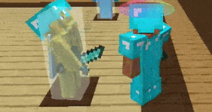
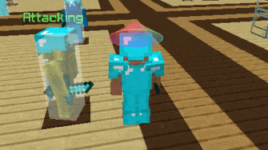
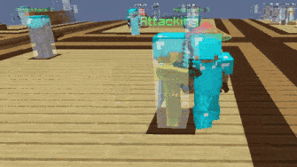
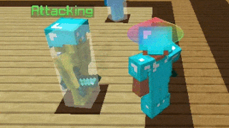

import Chip from '@mui/material/Chip'
import WarningIcon from '@mui/icons-material/Warning'
import VerifiedUserIcon from '@mui/icons-material/VerifiedUser'

# Velocity

Modifies knockback you receive from attacks

---

There are multiples modes of Velocity that all work differently, some are ghost
and some are very detected, please read the
[anticheat safety article](/guides/anticheat-safety) for more information.

## Jump Reset <Chip label="Ghost" color="success" size="small" component="a" href="/MedvedClient/guides/anticheat-safety#risk-labels" icon={<VerifiedUserIcon />}/>

Jumps after you take damage to legitimately reduce your knockback.

#### Chance %

How often you jump reset after taking knockback

#### Timing (ms)

How long after you've taken knockback before you jump

## Delay <Chip label="Ghost" color="success" size="small" component="a" href="/MedvedClient/guides/anticheat-safety#risk-labels" icon={<VerifiedUserIcon />}/>

Increases your ping so you can still move and attack while you've taken knockback by delaying it,
meaning if someone hits you in a fight you can still hit them while your knockback has been delayed.

#### Ground delay (ms)

Delay before reacting while on ground

#### Air delay (ms)

Delay before reacting while in air

## Reduce

Attacks the entity you're looking at and scales a specific percent of your knockback.
Works on some predictive anticheats but not all

#### Attack count

How many attacks it will perform on an entity

#### Range

Maximum distance an entity can attacked, this does NOT affect your reach

#### Horizontal

Percent of horizontal knockback to keep (0 = no kb, 1 = full kb)

#### Vertical

Percent of vertical knockback to keep (0 = no kb, 1 = full kb)

## Modify <Chip label="Warning" color="warning" size="small" component="a" href="/MedvedClient/guides/anticheat-safety#risk-labels" icon={<WarningIcon />}/>

Scales a specific percent of your knockback

#### Modify %

Percent of horizontal knockback to remove (0% = full kb, 100% = no kb)

#### Modify y %

Percent of vertical knockback to remove (0% = full kb, 100% = no kb)

## Freeze <Chip label="Warning" color="warning" size="small" component="a" href="/MedvedClient/guides/anticheat-safety#risk-labels" icon={<WarningIcon />}/>

Makes the server think your game is frozen, cancelling knockback

## Reverse <Chip label="Warning" color="warning" size="small" component="a" href="/MedvedClient/guides/anticheat-safety#risk-labels" icon={<WarningIcon />}/>

After a set amount of ticks (or instant), you will take forwards knockback
by a specified percent of the original knockback
(50% = cancels out original knockback). 

## Cancel <Chip label="Warning" color="warning" size="small" component="a" href="/MedvedClient/guides/anticheat-safety#risk-labels" icon={<WarningIcon />}/>

Cancels all knockback packets

