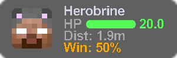
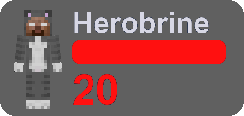

# Target HUD

Displays target info and fight prediction when in combat

:::warning
This module has either been added or heavily updated in the experimental version,
do not expect configuration options or this module to be available if you use the
latest release.
:::

---

### Position

Choose whether the HUD is static or floating.

- **STATIC**: fixed on-screen position
- **FLOATING**: follows the target smoothly from the side

### Design

Visual style of the target HUD.

- **GRIZZLY**: Grizzly Client's original target hud

- **CAMEL**: ported version of Camel Client's target hud

### BG color

Background color for the target HUD, with alpha support.

### Text shadow

Draw a shadow behind HUD text.
