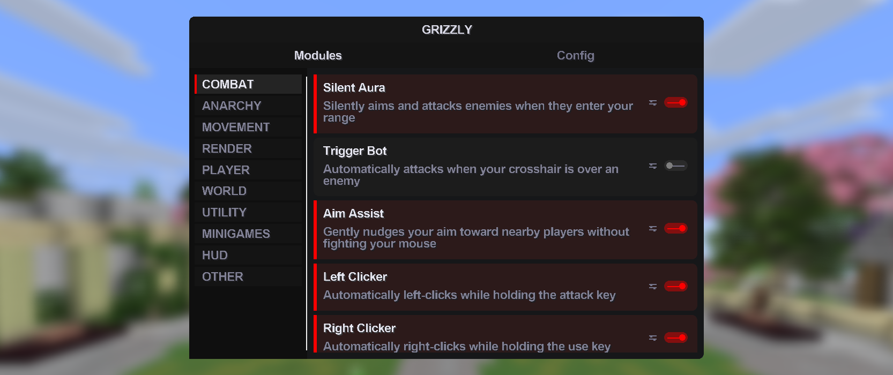

# Click Gui

The click GUI

---

### Mode

Choose the click GUI layout style.

- **DROPDOWN**: dropdown-based interface

- **SIDEBAR**: sidebar-based interface

### Show descriptions

Display module descriptions in the GUI when using dropdown mode.

### Show background

Render a background behind the GUI.

### Reset layout

Reset GUI positions to their defaults.