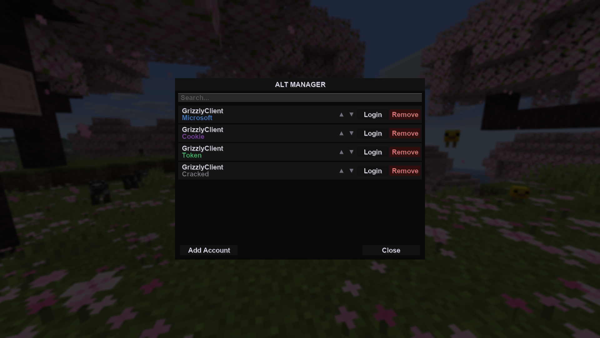

import AddingAlt from './img/adding-alt.png';
import MicrosoftAlt from './img/microsoft-alt.png';
import TokenAlt from './img/token-alt.png';
import CookieAlt from './img/cookie-alt.png';
import CrackedAlt from './img/cracked-alt.png';

# Alt Manager

Within the client is a built-in alt manager, allowing you to store and login to Minecraft accounts without needing to relaunch your game.

It can be accessed through the main menu of Minecraft in the top-right or
on the top-left of the Multiplayer menu.

You can remove accounts or move their positions by dragging them or by pressing
the ▲ or ▼ buttons.

Logging into an account is as easy as clicking on a profile's "Login" button, or
by double clicking the profile.

## Adding accounts

By pressing "Add Account", you can add four different types of accounts:

### Microsoft accounts

By linking your Microsoft account with a device access code, you can add
a Microsoft account.

These accounts require you to be logged in through a Microsoft account, if you
use your account and have full access to it through Minecraft.net, you can use
this as your login method to add your main accounts.

### Access Tokens

Many shops that sell alternate accounts sell as "mctokens" or "access tokens".

These are direct session tokens that let you login to Minecraft accounts.

### Cookies

When you log into Microsoft.com, your browser stores cookies on your login
information.

Some shops that sell alternate accounts will sell you a "cookie" rather than an
access token or the email and password. These cookies usually come as a
text file (.txt) that you download onto your computer.

You can select one of those files and the alt manager will automatically log into
it from the cookie.

### Cracked (Offline)

Some Minecraft servers allow players to play without having an actual Minecraft
account.

Simply set your username and you will be logged in without an authentication.
You wont be able to play on most servers, but you can set your username to
anything.

