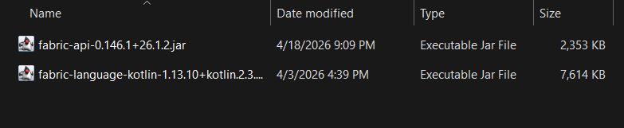

---

---
import FabricInfo from '@site/src/js/mcVersion/both'

# Installation

This is guide will show you how to download the latest version of Grizzly and launch it.

:::tip
If you want to install for Lunar Client, check the separate [tutorial](/intro/installation/lunar) for that.
:::

## Setting up Fabric

To get started, you must first download the Fabric mod loader. I highly suggest you read
the [official Fabric installation guide](https://docs.fabricmc.net/players/installing-fabric/).

:::info
<FabricInfo/>
:::

Once you've installed Fabric, locate your `mods` folder, if you use the official Minecraft
launcher and you use Windows, it will likely be located at `%appdata%/.minecraft/mods`.

You need to install 3 mods to get this client working:
- [Fabric API](https://modrinth.com/mod/fabric-api/versions)
- [Fabric Language Kotlin](https://modrinth.com/mod/fabric-language-kotlin)
- and the client jar (this will be in the next step)

Simply download those two jars from Modrinth and put them in your mods folder.

## Downloading the client

There are two different versions you can install, one being the latest release, and one being
the experimental latest artifact.

- **If you want the newest modules and dont mind potentially facing bugs, you can download the
latest [experimental version](/intro/installation/experimental).**

- **If you want a stable experience, download the latest [release version](/intro/installation/release).**

Once you've downloaded the `medved.jar`, place it in your mods folder:

## What next?

You've now successfully launched Grizzly Client, congratulations!

Check out the [quick start guide](/intro/quick-start) to see how to configure and enable modules.
