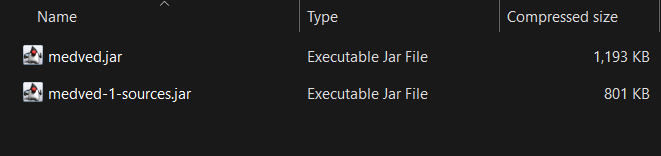

---

---

# Installation

## Downloading the latest build

Download the [Artifacts.zip](https://nightly.link/ghluka/MedvedClient/workflows/build/main/Artifacts.zip) file,
there should be two files here, the only one we want is `medved.jar`.

Copy that file or extract it, and place it in your mods folder:

