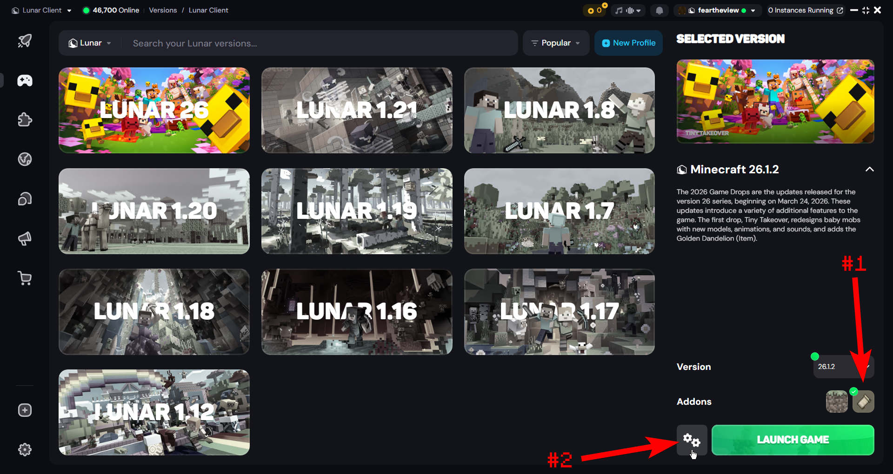
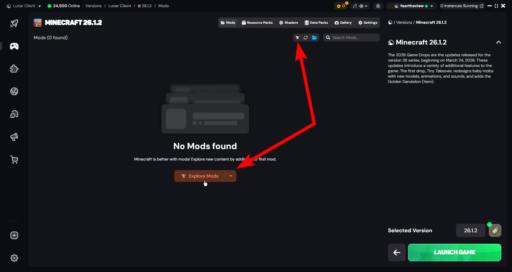
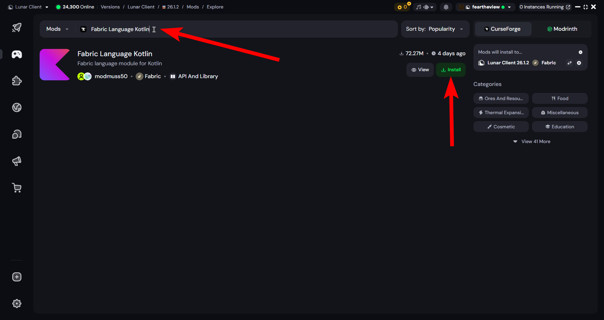
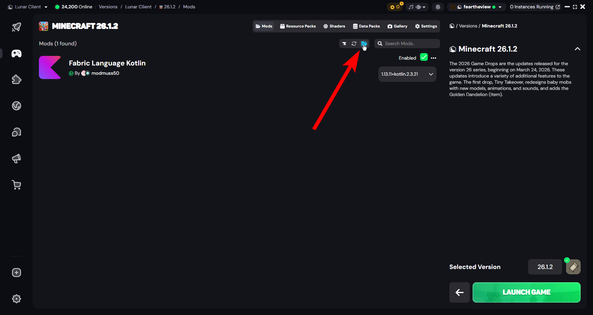
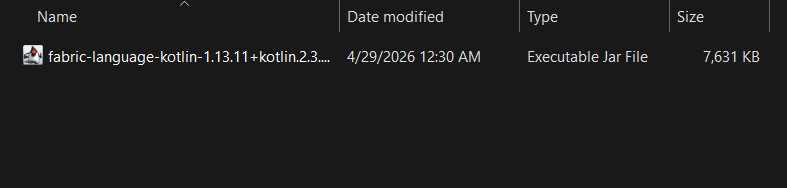
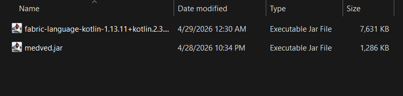
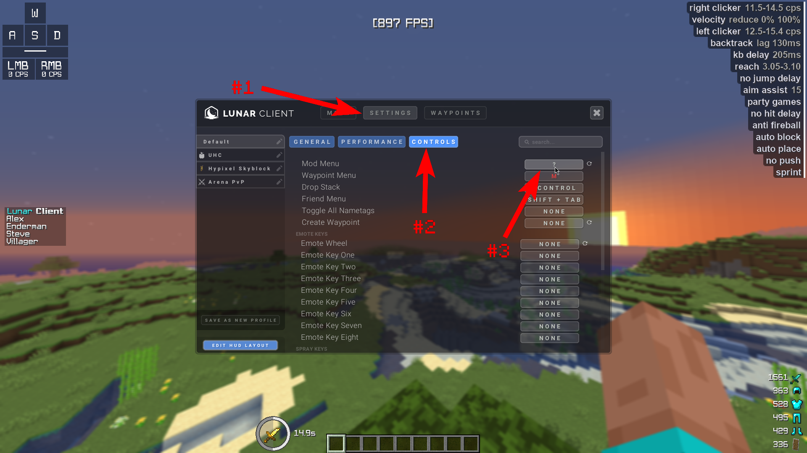

import FabricInfo from '@site/src/js/mcVersion/both'

# Lunar Installation

This is guide will show you how to download the latest version of Grizzly and launch it with Lunar client.

## Setting up Fabric

:::info
<FabricInfo/>
:::

In the Lunar Client launcher, go to the versions tab, make sure the "addons" have Fabric selected, and click on the cog in the bottom right:

Now go to "Explore Mods" (if you already see mods here, you will have to click the small icon in the top)

Search for and install "Fabric Language Kotlin", if it prompts you to select a version just pick the recommended one.

Now click on the folder icon to open your mods folder:

You should now have the mods folder open:

## Downloading the client

There are two different versions you can install, one being the latest release, and one being
the experimental latest artifact.

:::note
The stable version is not fully compatible with Lunar client.
**Use the experimental version.**
:::

- **If you want the newest modules and dont mind potentially facing bugs, you can download the
latest [experimental version](/intro/installation/experimental).**

- ~~**If you want a stable experience, download the latest [release version](/intro/installation/release).**~~

Once you've downloaded the `medved.jar`, place it in your mods folder:

## What next?

You've now successfully launched Grizzly Client with Lunar Client, congratulations!

Check out the [quick start guide](/intro/quick-start) to see how to configure and enable modules.

If the default keybind for the Click GUI opens the Lunar menu instead, change the Lunar keybind
to something else to access the Grizzly Click GUI:

