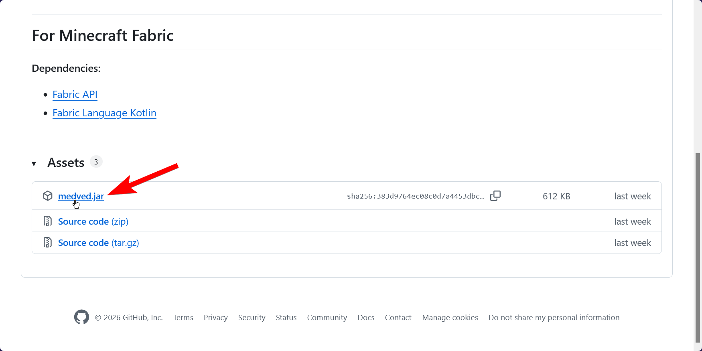
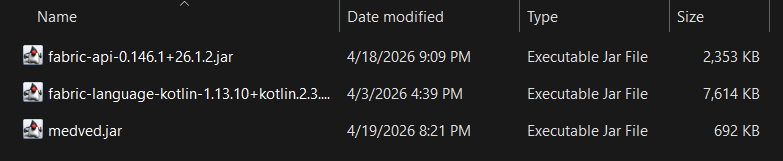

---

---

# Installation

## Downloading the latest release

Go onto the project's [latest release page](https://github.com/ghluka/MedvedClient/releases/latest) and download `medved.jar`.

Once you've downloaded the `medved.jar`, place it in your mods folder:

