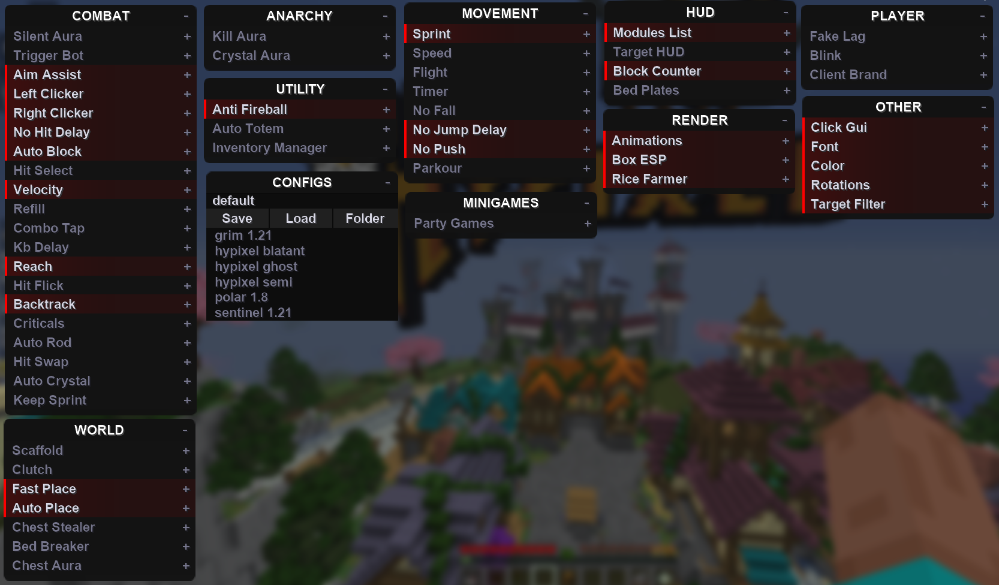
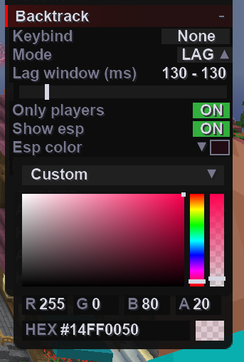
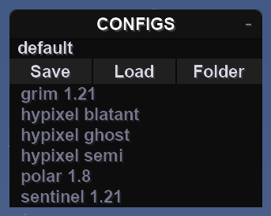

---

---

# Quick Start

This is a quick guide for getting started once you've [installed the client](/intro/installation).

## Opening the Click GUI

By default, the key is right shift, once you're in game, simply press the keybind to enable it.

## Modules

Modules, also sometimes referred to as "cheats" or "hacks", can be enabled or disabled to give
their described effect.

Left click on a module in the Click GUI to enable it or right click it to open it's configuration.

## Configs

You can quickly save and load configurations from the config panel:

You can also open the folder and get the configs as `.json` files, which you can
easily share with your friends.
